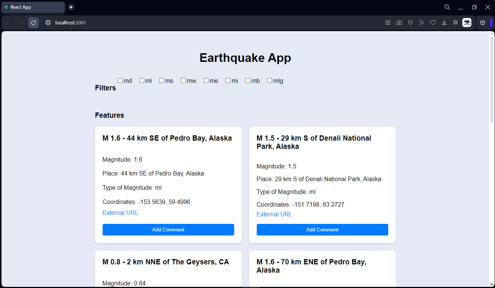
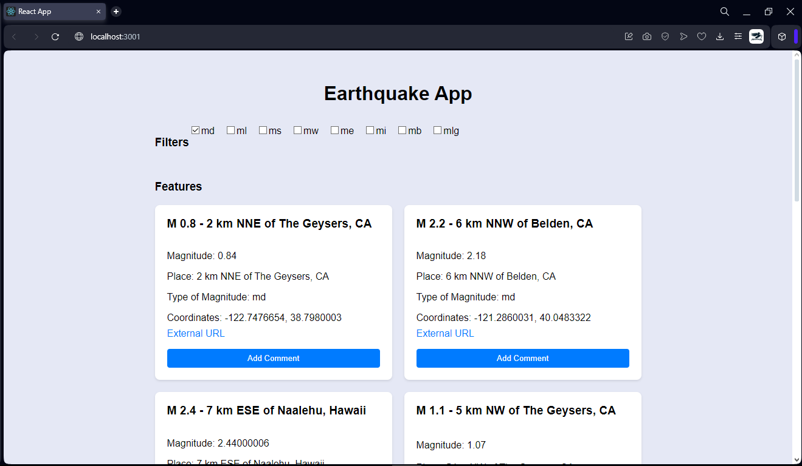
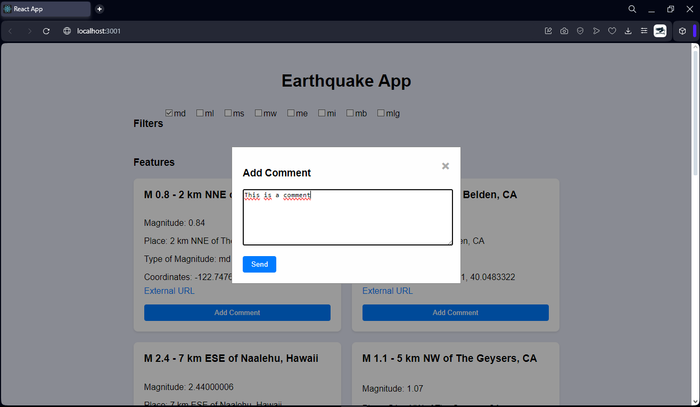

# Seismic Data Project

## General Description

This project consists of the development of an application in Ruby on Rails that obtains and delivers information related to seismological data in the United States.  It includes:

1. **Data Retrieval and Persistence**: A task to retrieve seismological data from the USGS feed (earthquake.usgs.gov) and persist it in a database, complying with certain validations.

2. **REST API Endpoints**:
   - **Endpoint 1**: Gets a list of seismic events (features) and allows filtering by `mag_type`, `page` and `per_page`.
   - **Endpoint 2**: Creates a comment associated to a specific seismic event (feature).

## Requirements

* Ruby version 3.1.0 or  higher
* Rails version 6.1.4 or higher
* Database like sqlite3 or PostgreSQL

## Project Configuration

1. **Clone the Repository**:
   ```
   git clone https://github.com/FranciscoLlinin/sismo_app.git
   cd sismo_app
   ```

2. **Install Dependencies**:
   ```
   bundle install
   ```
3. **Run the Data Retrieval and Persistence Task in the rails console**:
   ```
   EarthquakeDataSyncTask.new.perform
   ```
   This task is responsible for fetching seismic data from the USGS feed and persisting it to the database.

4. **Configure the Database**:
   ```
   rails db:migrate
   ```

## Running the Server
To bring up the server, run the following command:
```
rails server
```

The server will start at `http://localhost:3000`.


## REST API Endpoints

### Endpoint 1: Get List of Features
**Method**: `GET`
**URL**: `http://localhost:3000/api/features`

**Response**:


**Query Parameters**:
- `filters[mag_type]`: Filter by one or more magnitude types (md, ml, ms, mw, me, mi, mi, mb, mlg).
- `page`: Result page number (default: 1)
- `per_page`: Number of results per page (max.: 1000, default: 20)

**Response**:


### Endpoint 2: Create a Comment
**POST method
**URL `http://localhost:3000/api/features/{feature_id}/comments`

**Upload**:
```json
{
    "comment":{
         "body": "This is a comment"
    }
  
}
```

**Response**:


## Frontend with REACT
To bring up frontend  in React you need to install NodeJS and npm then run the following commands from your terminal:

1. **Access to frontend folder**:
   ```
   cd frontend
   ```
2.  **Installation**: Install the dependencies using npm

3. Run the server in development mode using the following command: 
   ```
   npm run start
   ```
The server will start at `http://localhost:3000`, but but since the rails server is on that port it will open at `http://localhost:3001`.   

4.  Open your browser and the app will be ready to use

### App



### Filters



### Comments

